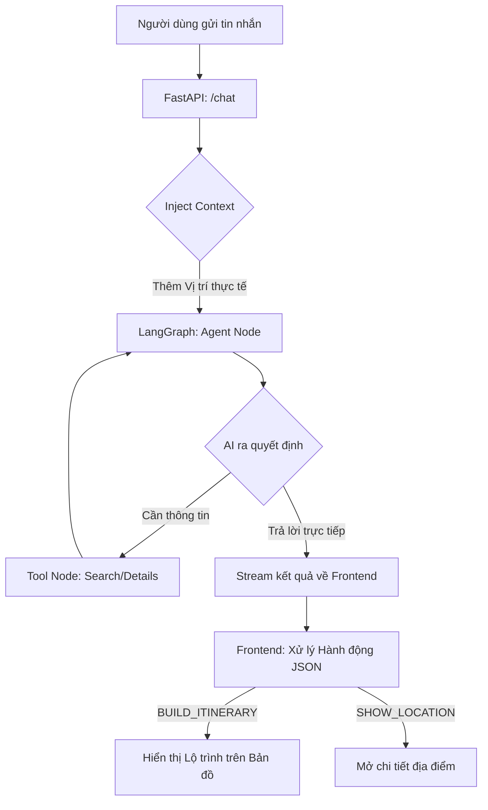

# 🌏 Quy trình xử lý TravelBuddy AI Agent

Tài liệu này mô tả luồng logic từ khi nhận tin nhắn người dùng đến khi trả về kết quả trên giao diện.

## 1. Sơ đồ luồng (Workflow Map)

## 2. Chi tiết các bước xử lý

### Bước 1: Tiếp nhận và Tiền xử lý (FastAPI Layer)
- Hệ thống nhận tin nhắn cùng tọa độ GPS hoặc tên vị trí (`location_name`) từ Frontend.
- **Tiêm ngữ cảnh (Context Injection)**: Một dòng thông báo vị trí được tự động chèn vào cuối tin nhắn của người dùng để AI biết bạn đang đứng ở đâu (ví dụ: `[User is currently at: Hội An]`).

### Bước 2: Xử lý tại Agent (LangGraph Node)
- **Agent Node**: Sử dụng mô hình `gpt-4o` để phân tích ý định người dùng. AI được hướng dẫn ưu tiên sử dụng vị trí có sẵn trong Context để chào hỏi.
- **Lập kế hoạch Tool**: Nếu người dùng hỏi "Xung quanh đây có gì?", AI sẽ quyết định gọi công cụ `search_nearby_attractions`.

### Bước 3: Thực thi Công cụ (ToolNode)
- Các Tool truy xuất dữ liệu từ `data.py` (danh sách địa danh địa phương).
- Kết quả từ Tool được gửi ngược lại cho Agent để tổng hợp thành câu trả lời tự nhiên.

### Bước 4: Trả về và Xử lý Giao diện (Frontend Layer)
- Kết quả được stream về Frontend từng token (hoặc nguyên tin nhắn tùy cấu hình).
- **Hành động JSON**: Nếu AI muốn tạo lịch trình, nó sẽ kèm theo một khối JSON ẩn (đã được lọc bỏ khi hiển thị). Frontend sẽ "bắt" khối JSON này để:
    - Vẽ đường đi trên bản đồ.
    - Cập nhật danh sách các điểm tham quan.

## 3. Quản lý Hiệu năng (Telemetry)
Sau mỗi lượt hội thoại, hệ thống sẽ in ra Console các thông số:
- **Độ trễ (Latency)**: Thời gian phản hồi của AI.
- **Token Usage**: Theo dõi chi phí và giới hạn của model.

---
**Ghi chú**: Mọi thay đổi về logic AI nên được thực hiện tại `agent.py`, trong khi logic truyền nhận dữ liệu nằm tại `main.py`.
